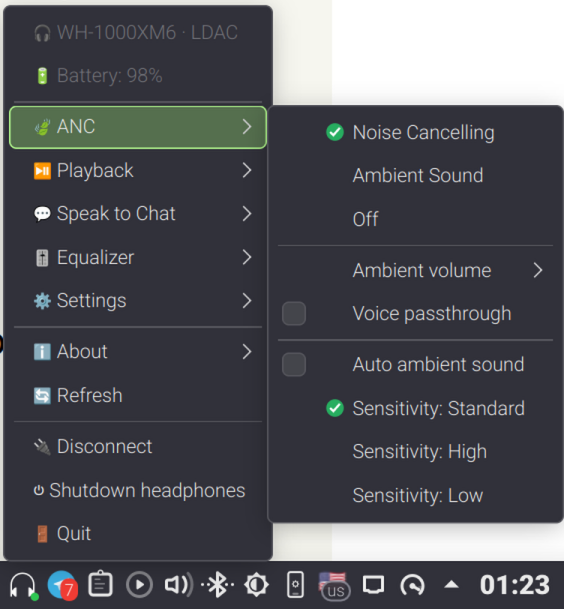

# Sony Buds Tray Control

A lightweight KDE system tray control for Sony headphones with MDR V2 protocol.

Reimplemented in rust based on  [SonyHeadphonesClient](https://github.com/mos9527/SonyHeadphonesClient)

Tested on WH-1000XM6 and WF-1000XM5



## Features
- Control almost all features supported by Android app from tray
- Quickly switch NC mode by single click on tray icon
- Display multipoint devices, switch playback or connect a paired device

Both transports used by the reference client are supported:
- Classic Bluetooth via RFCOMM + SDP service discovery via `libbluetooth` and BLE GATT (TANDEM_OVER_BLE_HPC service via BlueZ D-Bus)

## Building

Requires Rust 1.75+ and the usual BlueZ stack:

```bash
cargo build --release
```

Runtime dependencies: a running BlueZ daemon and (for Classic Bluetooth)
`libbluetooth`.

## Usage

```bash
sony-buds-tray-control
```

Open the tray icon, pick Connect, choose the transport, scan
and connect. Settings are committed to the device as you change them; battery
is refreshed periodically and on demand (Refresh).

## Disclaimer

This product is not affiliated with Sony. Use at your own risk.
